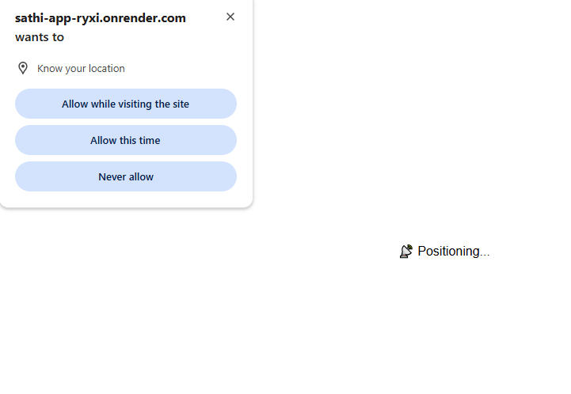
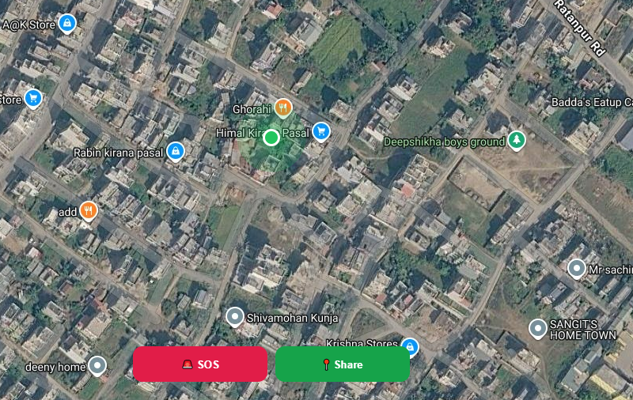
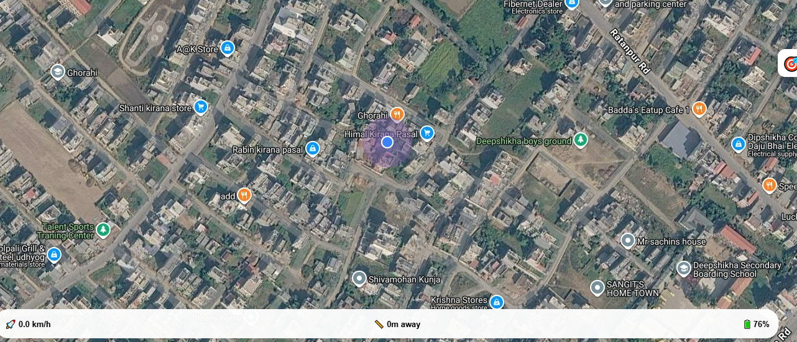

Sathi – Simple Real-Time Location Sharing

Sathi is a real-time location sharing web application that allows users to generate a unique tracking link and share their live location instantly.

No login. No signup. Just share the link.

Built using the MERN stack with Socket.io for real-time communication and Leaflet.js for interactive maps.

 Live Demo

🌍 App: https://sathi-app-ryxi.onrender.com

✨ Features

 Generate unique tracking link
 Share live location instantly
 Interactive map using Leaflet.js
 Real-time updates with Socket.io
 MongoDB Atlas database
 Deployed on Render
 Responsive design

## 🛠️ Tech Stack

 Screenshots
## 🏠 Home Page

## 🗺️ Live Map

## 🔗 Share Link

⚙️ Installation & Setup

1️⃣ Clone Repository
git clone https://github.com/aarju-basnet/sathi.git
cd sathi

2️⃣ Backend Setup
cd backend
npm install

Create .env file:

PORT=5000
MONGO_URI=your_mongodb_connection_string
CLIENT_URL=http://localhost:5173

Run backend:

npm start

3️⃣ Frontend Setup

cd backend
npm install

Create .env:

VITE_API_URL=http://localhost:5000

Run frontend:

npm run dev

🌍 Deployment

Frontend: Render
Backend: Render
Database: MongoDB Atlas

 What I Learned

Real-time communication with Socket.io
WebSocket handling in production
Managing environment variables
MongoDB Atlas integration
Deploying full-stack apps

📌 Future Improvements

Improve mobile UI
Add QR code sharing

👨‍💻 Author

Aarju Basnet
Bsc CSIT Student | MERN Developer
Nepal 🇳🇵

🎯 Important

“No login required. Just generate and share.”